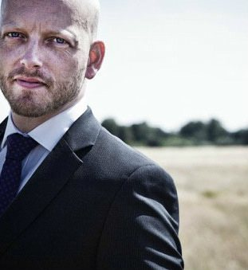

    

        

            
    
                

                    

                    <h3 class="visible-xs visible-sm visible-md visible-lg white">
                        About us</h3>
                    <h1 class="hidden-xs visible-sm visible-md visible-lg thin white">
                        We bring trust  
                        to the internet
                    </h1>
                    <h2 class="hidden-sm hidden-md hidden-lg thin white">
                        We bring trust  
                        to the internet
                    </h2>
                

            

        

    

    

        

            

            

            

                

                    

                        

                            

                                Veridu was founded in 2014 by serial entrepreneur, Rasmus Groth; identity industry veteran, Ian Green; and technologist Flavio Heleno. Our mission is to bring trust to the internet with global and cost-effective digital identity solutions.
                            

                        

                        

                            

                                Originally established in Copenhagen (Rasmus's home city), Veridu is now headquartered in London with a further office in Sao Carlos, Brazil, where our technical team is based.
                            

                        

                        

                            

                                Current investors in Veridu include <a target="_blank"  href="http://www.worldpay.com">Worldpay</a>, <a target="_blank"  href="http://www.fomcap.com">Force Over Mass Capital</a>, <a target="_blank"  href="http://www.finextra.com/resources/fullsolns.aspx?companyid=3166"> Callatay and Wouters Ventures</a>, as well as <a target="_blank"  href="https://www.youtube.com/watch?v=yBWM_tEhttw">Philip McGriskin</a> and Paul Townsend, founders of Envoy (sold to Worldpay).
                            

                             
                        

                    

                

            

        

    

    

        

            
            <h3 class="about-text">RASMUS GROTH</h3>
            
Founding CEO

            

                Rasmus is a passionate innovator and full stack entrepreneur with a number of successful exits behind him. Veridu was born out of Nuffly, one of Rasmus's previous startups, that aimed to create an automatic backup of a user's social media accounts.
            

             
            

            

        

        

            
            <h3 class="about-text">IAN GREEN</h3>
            
Co-founder & Chief Sales Officer

            

                Ian drove the 192business global sales and business development strategy to create one of Europe's most successful identity businesses. He's now doing the same for Veridu, where he's responsible for our partnership with Worldpay.
            

             
            

            

        

        

            
            <h3 class="about-text">FLAVIO HELENO</h3>
            
Co-founder & CTO

            

                Flavio leads Veridu's technology team, based in Brazil. With experience of both working in startups and consulting for a number of large Brazilian organisations, Flavio brings a unique perspective to our product development strategy.
            

             
            

            

        

        

            
            <h3 class="about-text">CASSIE CRADDOCK</h3>
            
Head of Sales

            

                Cassie is our payments expert, joining Veridu from MangoPay. With deep understanding of the workings of online payments, Cassie is responsible for driving our business forward with a focus on payment service providers and eCommerce.
            

             
            

            

        

        

            
            <h3 class="about-text">RONALD VAN SPRONSEN</h3>
            
Head of Operations

            

                Ronald joined Veridu at a critical stage of the company's growth. With a wealth of project management experience gained at large enterprises, Ronald is responsible for implementing internal processes and procedures to allow Veridu to scale up as the business grows.
            

             
            

            

        

        

            
            <h3 class="about-text">MAGALIE PIMENTEL</h3>
            
Head of Marketing

            

                Magalie is responsible for driving brand awareness and lead generation for Veridu globally. Having spent many years working for financial crime solution providers, Magalie has a deep understanding of the issues facing Veridu's customers.
            

             
            

            

        

        

            
            <h3 class="about-text">CARL EJLERS</h3>
            
Head of Creative

            

                Carl is passionate about design. He joined Veridu having spent time working in advertising agencies around the world and brings vast knowledge of how to design for the ultimate customer experience.
            

             
            

            

        

        

            
            <h3 class="about-text">CASSIO PEREIRA</h3>
            
Head of Data Science

            

                Cassio is the brains behind Veridu's machine learning programme. As a mathematics wizard with a PhD in artificial intelligence, Cassio is responsible for developing and training the models we use to determine the credibility of a user's digital footprint.
            

             
            

            

        

        

            
            <h3 class="about-text">RAFAEL CAMPANARI</h3>
            
Lead Front-End Developer

            

                Rafael is responsible for bringing our identity solutions to life, and ensuring they provide the best possible user experience to both our direct customers, and their customers.

            

             
            

            

        

        

            
            <h3 class="about-text">ALVARO MELLO</h3>
            
Project Manager

            

                Alvaro has the task of keeping our technology team working to schedule - no easy feat given the pace of innovation at Veridu.
            

             
            

            

        

        

            
            <h3 class="about-text">CAUE GERALDO LORENZATO</h3>
            
Software Developer

            

                Caue maintains our key SDKs, and does an amazing job of making sure they're always up-to-date with the latest API features, fully documented and thoroughly tested. 
            

            

            

        

    

    
  
        

            

                Solutions  
                <a class="footer" href="./onboarding.html">Onboarding</a> 
                <a class="footer" href="./transactions.html">Transactions</a> 
                <a class="footer" href="./activity.html">Internet Life</a> 
            

        

        

            

                Contact  
                <a class="footer" href="http://veridu.com/contact.html">Get in Touch</a> 
                <a class="footer" target="_blank" href="http://www.mynewsdesk.com/uk/veridu-com">Press Room</a> 
                <a class="footer" href="mailto:support@veridu.com" target="_top" target="_top">Support</a> 
                <a class="footer" href="mailto:sales@veridu.com" target="_top" target="_top">Sales</a> 
                <a class="footer" href="mailto:jobs@veridu.com" target="_top" target="_top">Careers</a> 
            

        

        

            

                Demos  
                <a class="footer" target="_blank" href="http://demo.veridu.com/onboarding/">Onboarding</a> 
                <a class="footer" target="_blank" href="http://demo.veridu.com/payments/">Transactions</a> 
                <a class="footer" target="_blank" href="http://demo.veridu.com/popup-widget/">Pop-up Widget</a> 
            

        

        

            

                Integration  
                <a class="footer" target="_blank" href="https://veridu.com/wiki/Widget_Library">Getting Started</a> 
                <!--<a class="footer" href="https://veridu.com/wiki/Widget_Library">Widgets</a> 
                <a class="footer" href="https://veridu.com/wiki/Category:SDK">SDKs</a> 
                <a class="footer" href="https://veridu.com/wiki/Category:Endpoint">APIs</a> 
                <a class="footer" href="https://veridu.com/wiki/Veridu_ID_Gateway">Gateways</a> -->
            

        

        

            

                Legal  
                <a class="footer" target="_blank" href="https://veridu.com/wiki/Terms_%26_Conditions">Terms & Conditions</a> 
                <a class="footer" target="_blank" href="https://veridu.com/wiki/Veridu:Privacy_policy">Privacy Policy</a> 
                <a class="footer" target="_blank" href="https://veridu.com/wiki/Service_Level_Agreement">Service Level Agreement</a> 
                <a class="footer" target="_blank" href="https://veridu.com/wiki/Security_Procedures">Security Procedures</a> 
            

        

        

            
 
                Follow  
                <a class="footer" target="_blank" href="https://www.linkedin.com/company/2719895?trk=vsrp_companies_cluster_name&trkInfo=VSRPsearchId%3A264505601473850220715%2CVSRPtargetId%3A2719895%2CVSRPcmpt%3Acompanies_cluster">
                    LinkedIn
                </a> 
                <a class="footer" target="_blank" href="https://medium.com/@VeriduHQ">
                    Medium
                </a> 
                <a class="footer" target="_blank" href="https://www.facebook.com/VeriduHQ/?fref=ts">
                    Facebook
                </a> 
                <a class="footer" target="_blank" href="https://twitter.com/VeriduHQ">
                    Twitter
                </a> 
                <a class="footer" target="_blank" href="https://www.youtube.com/channel/UC71f4rr0XBjx6df2eIooM2w">
                    YouTube
                </a> 
                <a class="footer" target="_blank" href=" https://angel.co/veridu">
                    AngelList
                </a> 
            

        

    

