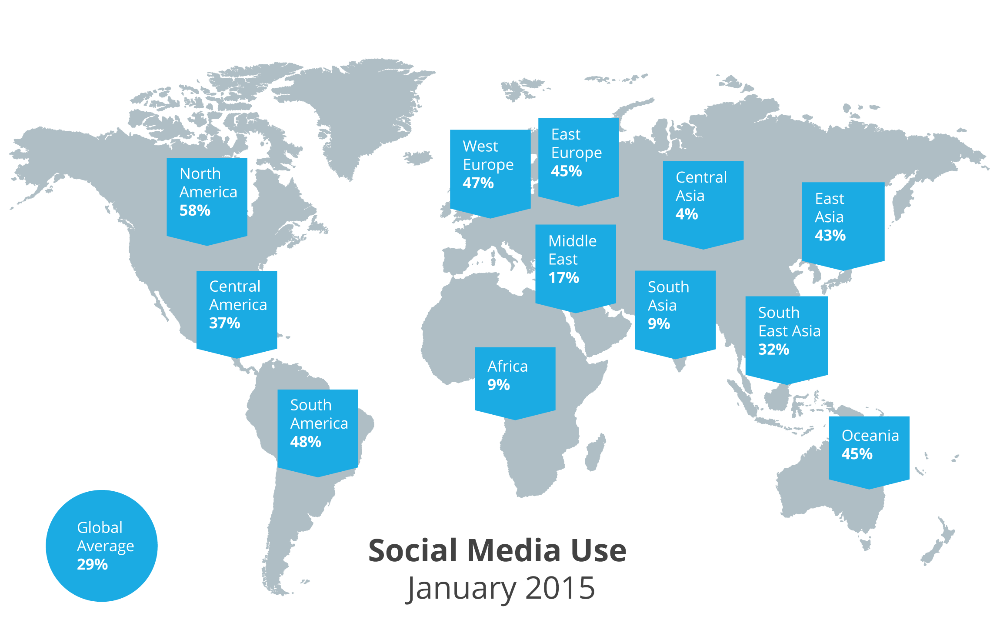

<article>
	

		

			

				

				

			

			

				<h1 class="article__title">
					

						Veridu for Cryptocurrency Wallets
					

				</h1>
				<h4 class="article__excerpt hidden-xs">
					

						Whether you’re regulated as a money transmitter or just want to protect your reputation by being proactive about knowing your customers, identity verification is a huge challenge for cryptocurrency wallet providers.
					

				</h4>
			

		

		<h4 class="article__excerpt visible-xs">
			Whether you’re regulated as a money transmitter or just want to protect your reputation by being proactive about knowing your customers, identity verification is a huge challenge for cryptocurrency wallet providers.
		</h4>

		

			

				<h4>A happy user is an active user</h4>

				

					Whether you’re regulated as a money transmitter or just want to protect your reputation by being proactive about knowing your customers, identity verification is a huge challenge for cryptocurrency wallet providers.
				

				

					Forums are full of tirades from users unable to sign up to their wallet of choice because they didn’t have the right identity documents, from those frustrated with the hoops they had to jump through to prove their identity and from users locked ou of their accounts for days at a time.
				

				<h5>What if your wallet eliminated these frustrations? What if you could...</h5>

				

					<ul class="no-bullets">
						<li>
							&bullet; &nbsp; &nbsp;Safely grow your userbase in regions with a large unbanked or underbanked population?
						</li>
						<li>
							&bullet; &nbsp; &nbsp; Attract more users by improving the security of your wallet without affecting their experience?
						</li>
						<li>
							&bullet; &nbsp; &nbsp; Retain users by offering a slick account reactivation experience?
						</li>
					</ul>
				

				<h5>What if you used Veridu?</h5>
				
Veridu brings trust to the internet with consent-driven social identity solutions. Our solutions allow you to enhance customer due diligence globally without friction, and at a low price point.

				
You can quickly and easily integrate us into your onboarding process using our widgets or our API and our solutions are truly mobile friendly.

				<h5>
					Why Veridu?  
					Get more users globally
				</h5>

				
Don’t ignore the enormous potential in the unbanked and underbanked markets just because you can’t easily verify identity using traditional means - use social identity to mitigate the risk and reap the rewards.

				
Veridu covers all the major global social networks (there are over 2bn active social media users globally) and uses proprietary and sophisticated algorithms to calculate a user’s credibility based on this data.

				
				<quote class="span-both">
					<em>Total active users on the top social network in each country, based on We Are Social’s Digital, Social and Mobile in 2015 Report.</em>
				</quote>

				<h5>Onboard more users and protect your reputation with social KYC</h5>
				
Do you really need to see an official identity document for a user just to sign up to your wallet, or to carry out a low value transaction? Then answer is no.

				
Our social Know Your Customer (KYC) solution verifies a user’s identity in real-time. It’s quick, frictionless and mobile-friendly too, and can be used when onboarding and/or at the point of transaction.

				<h5>Reactivate accounts more quickly</h5>

				
Nothing is more frustrating for a user than being locked out of their account for days while their identity is being verified because they’ve lost their login credentials.

				
When a user is locked out of their account, give them the option of proving they are who they say they are with a variety of identity verification challenges, that can be completed on a mobile, for faster account reactivation.

				<h5>Give us a go</h5>
				
Like what you’ve read? Sign in with your social networks to try us for yourself.

				<h5>A User’s Story</h5>

				<em>
					
“I tried to set up a Bitcoin wallet as a friend told me it was a quick, easy and cheap way to transfer money to anyone, anywhere in the world.

					
Turns out it wasn’t so easy… They wanted my ID documents, which I didn’t have with me at the time. When I was able to share them I thought that would be that. It wasn’t - they needed to approve my account. That could take 48 hours. It might be cheap, but it certainly wasn’t quick and easy.”

				</em>

				<h5>What our customers say…</h5>

				<quote >
					<em>“We especially like the frictionless user experience. If you have a consumer facing mobile app and need to integrate ID services I highly recommend checking out Veridu.”</em>
					Volker Breuer, CEO, PayFriendz
				</quote>

				<h5>Want to know more? Contact hello@veridu.com</h5>

				<section class="contact veridu-list">
				    

				        <h2 class="font-light">Contact us</h2>

				        <form  class="form-horizontal" role="form" action="https://www.getdrip.com/forms/8370268/submissions" method="post" data-drip-embedded-form="8370268" ng-submit="ctrl.sendContact()">
				            

				                <input ng-model="ctrl.contact.first_name" name="fields[first_name]" type="text" placeholder="First Name" >
				            

				            

				                <input ng-model="ctrl.contact.last_name" name="fields[last_name]" type="text" placeholder="Last Name">
				            

				            

							

				                <input ng-model="ctrl.contact.company" name="fields[company]" type="text" placeholder="Company" >
				            

				            

				                <input ng-model="ctrl.contact.job_title" name="fields[job_title]" type="text" placeholder="Job Title">
				            

							

				            

				                <input ng-model="ctrl.contact.email"  name="fields[email]" type="email" placeholder="Email">
				            

				            

				                <input ng-model="ctrl.contact.phone" class="half"  name="fields[phone]" type="text" placeholder="Phone">
				            

				            

				            

				                <textarea rows="5" ng-model="ctrl.contact.message" name="fields[tell_us_more]" name="message" type="text" placeholder="Message"></textarea>
				            

				            

				                <button type="submit" class="btn btn-primary btn-primary--text-white">Submit</button>
				            

				        </form>

				    

				</section>

			

			

				<h5>TAGS</h5>

				
World Pay

				
PayFriendz

				
ZipMoney

				

				
Social Media & Online Services

				
Knowledge-based Authentication

				

				
Contact Info

				
Age

				
Insight

				

				
API

			

		

	

</article>

